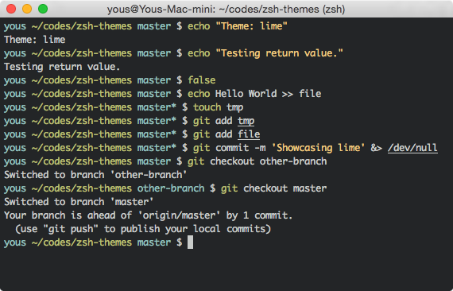

# Lime

Simple standalone Zsh theme.



Colors are brought from [Tomorrow
Night](https://github.com/chriskempson/tomorrow-theme#tomorrow-night).

## Usage

### [Antigen](https://github.com/zsh-users/antigen)

``` zsh
antigen bundle yous/lime
```

### [zgen](https://github.com/tarjoilija/zgen)

``` zsh
zgen load yous/lime
```

### [zplug](https://github.com/b4b4r07/zplug)

``` zsh
zplug "yous/lime"
```

### [oh-my-zsh](https://github.com/robbyrussell/oh-my-zsh)

Clone this repository and make symbolic links to oh-my-zsh.

``` sh
git clone https://github.com/yous/lime.git
cd lime
ln -s "$PWD/lime.plugin.zsh" ~/.oh-my-zsh/themes/lime.zsh-theme
```

Then select the theme in `.zshrc`:

``` zsh
ZSH_THEME="lime"
```

## Options

### `LIME_SHOW_HOSTNAME`

Set `LIME_SHOW_HOSTNAME=1` to see the hostname when you're connecting via SSH.
The default value is `0`.

## License

Copyright (c) 2014-2016 Chayoung You. See [LICENSE.txt](LICENSE.txt) for
details.
